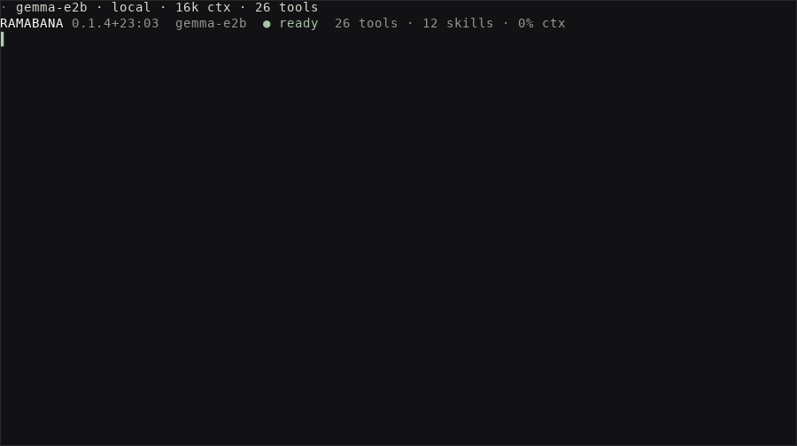
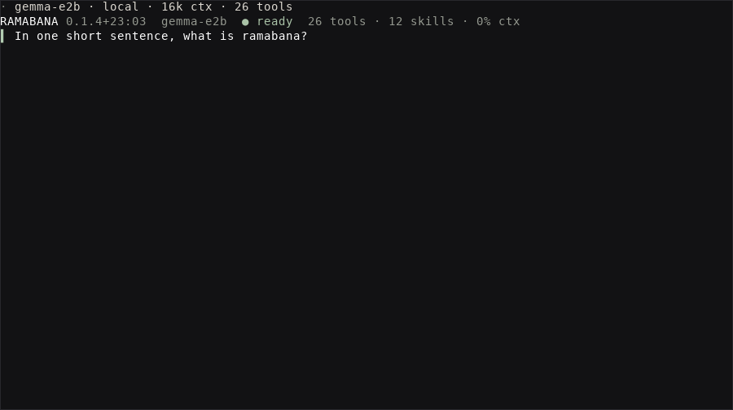
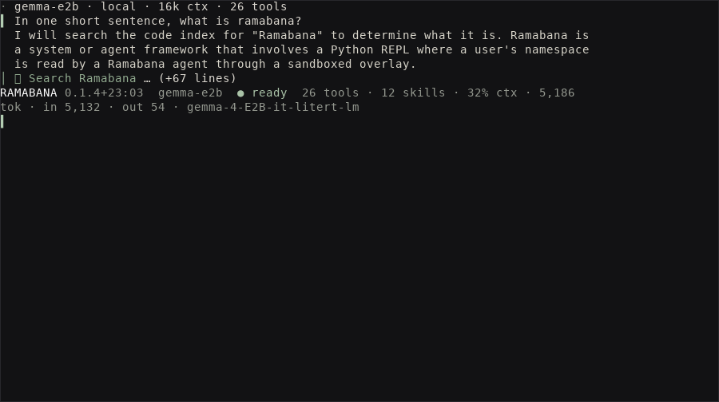

# ramabana


<!-- WARNING: THIS FILE WAS AUTOGENERATED! DO NOT EDIT! -->

<p align="center">


</p>

<p align="center">

<em>rama’s arrow. a harness that does not miss.</em>
</p>

**ramabana** is the brain of a coding agent: policy, tools, memory, and routing — no editor, no IDE. Hosts speak one protocol; models arrive through [rishi](https://github.com/vedicreader/rishi) (LiteRT · MLX · llama.cpp · Cursor · hosted APIs).

It ships a terminal app and an MCP server on that same host protocol.

## See it

Gemma 4 on LiteRT, running locally in the CLI:

<p align="center">


</p>

| ready | typing | reply |
|:--:|:--:|:--:|
|  |  |  |

[Download the MP4](media/ramabana-cli-demo.mp4)

## Install

``` sh
pip install 'ramabana[cli]'          # harness + terminal
pip install 'ramabana[all]'          # cli + mcp + pyrepl
```

Models are not bundled. rishi fetches on first use. LiteRT defaults to GPU and falls back to CPU; pin with `RAMABANA_LITERT_BACKEND=cpu`.

## CLI

``` sh
ramabana --root . --model gemma-e4b                 # interactive
ramabana --root . --model gemma-e2b --approve auto 'Reply with exactly: pong'
ramabana --python --root .                          # Python mode inside the same UI
ramabana-mcp --root .                               # same tools over MCP
```

## Agent

[`LocalHost`](https://vedicreader.github.io/ramabana/tools.html#localhost) indexes open folders; tools the host cannot perform are never offered to the model.

``` python
from ramabana import Agent
from ramabana.tools import LocalHost, tools_for

host = LocalHost(['..'], web=True)
agent = Agent(host, extensions=False)
len(agent.tools), agent.ready, agent.note
```

    (23, False, 'not started')

One turn is `ask`. Scripted backends keep docs reproducible — see [testing](04_testing.ipynb).

``` python
from ramabana.testing import fake_agent

scripted, backend = fake_agent(replies=['`threshold` is in `ramabana/runtime.py`.'])
scripted.ask('where is the compaction threshold?')
```

    '`threshold` is in `ramabana/runtime.py`.'

## What you get

| Capability | Built on | What it does |
|----|----|----|
| Any model runtime | [rishi](https://github.com/vedicreader/rishi) | LiteRT, MLX, llama.cpp, Cursor and hosted APIs behind one `Chat` |
| Code index | [kosha](https://github.com/vedicreader/kosha) | FTS + vectors + call graph over open folders *and* packages |
| Search fusion | [litesearch](https://github.com/vedicreader/litesearch) | one ranking from kosha, ripgrep and vault prose (RRF) |
| Web research | [fossick](https://github.com/vedicreader/fossick) | search, escalating fetch, cited digests |
| Durable memory | [vishalakshi](https://github.com/vedicreader/vishalakshi) | vault of what was read, federated search, watches |
| Editing | [exhash](https://github.com/vedicreader/exhash) | hash-verified line addressing |

**Routing** keeps cheap jobs on a small local model. **Capability probing** means a missing host skill shrinks the tool list instead of breaking the turn.

## Modules

| notebook | module | owns |
|----|----|----|
| `00_core` | `ramabana.core` | errors, environment, model routing |
| `01_runtime` | `ramabana.runtime` | rishi adapter, usage, compaction |
| `02_tools` | `ramabana.tools` | [`Host`](https://vedicreader.github.io/ramabana/tools.html#host), [`LocalHost`](https://vedicreader.github.io/ramabana/tools.html#localhost), tools, skills, sub-agents |
| `03_agent` | `ramabana.agent` | approvals, activity feed, [`Agent`](https://vedicreader.github.io/ramabana/agent.html#agent) |
| `04_testing` | `ramabana.testing` | full-capability host and backend doubles |
| `05_cli` | `ramabana.cli` | terminal app ([teleprint](https://github.com/answerdotai/teleprint)) |
| `06_mcp` | `ramabana.mcp` | same tools over MCP |
| `07_vault` | `ramabana.vault` | durable memory and watches |
| `08_shop` | `ramabana.shop` | agent trolley on fossick |
| `09_coding_patterns` | `ramabana.coding_patterns` | coding standards as a skill |
| `10_spec` | `ramabana.spec` | OpenAPI / Discovery specs as tools |
| `11_pyrepl` | `ramabana.pyrepl` | `--python` kernel on [dhrishti](https://github.com/vedicreader/dhrishti) |

## Develop

Notebooks in `nbs/` are the source. Never edit generated modules.

``` sh
uv sync --all-extras --group dev
uv run nbdev-export
uv run nbdev-test
uv run pytest
uv run nbdev-clean
```

Docs: [vedicreader.github.io/ramabana](https://vedicreader.github.io/ramabana/)
