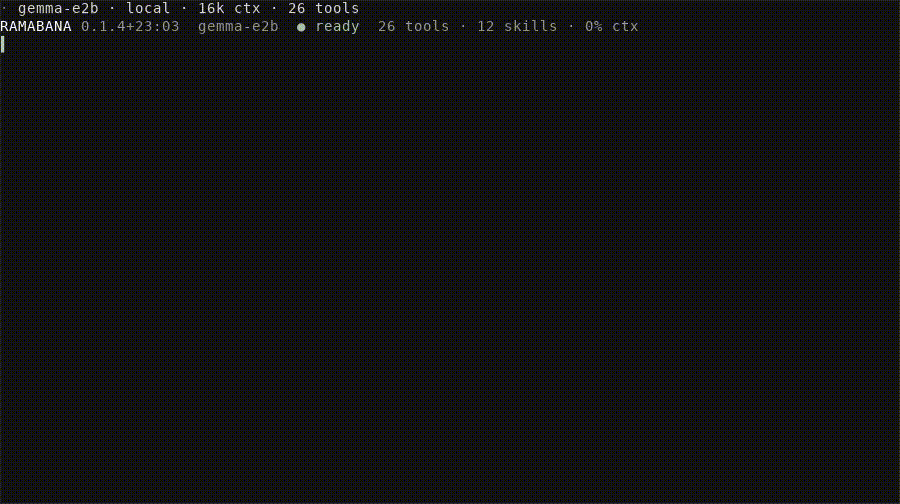

# ramabana


<!-- WARNING: THIS FILE WAS AUTOGENERATED! DO NOT EDIT! -->

<p align="center">


</p>

[`Agent`](https://vedicreader.github.io/ramabana/agent.html#agent) runs a model against the tools supplied by a host. A host defines the folders, network access, memory, and approval gate available to the model. The terminal, MCP server, and Agent Client Protocol server use the same agent and tool contracts.

Start with one folder. Ramabana can write only inside the folders named by `--root`. Read access also stays inside those folders. `--read-outside` widens read access to the machine.

<p align="center">


</p>

## Install

Ramabana needs Python 3.12 or newer. Everything it imports is a dependency, and the terminal is
the one extra:

``` sh
pip install ramabana           # the agent, the hosts, the tools, and every server below
pip install 'ramabana[cli]'    # and the terminal session
```

| command | what it is |
|----|----|
| `ramabana` | the terminal session, on teleprint. The one that needs `[cli]` |
| `ramabana-mcp` | the MCP server |
| `ramabana-acp` | the Agent Client Protocol server an editor launches |
| `ramabana --python` | the Python prompt, on dhrishti |
| `ramabana-tick` | the scheduled beat, on pobblebonk |

## Point it at a model

`--model` names the model this session’s turns run on. Without it the turn model is `$RAMABANA_MODEL`, then `$LEELA_MODEL`, then `gemma-e4b` on the device.

``` sh
ramabana --root . --model sonnet
export RAMABANA_MODEL=sonnet    # the same choice in every session
```

| names | runs on | credential |
|----|----|----|
| `opus`, `sonnet`, `fable`, `claude-opus-5`, `claude-sonnet-5`, `claude-haiku-4-5` | Claude Code | a `claude /login` session |
| `gpt`, `gpt-mini`, `gpt-sol`, `gpt-5.6`, `gpt-4.1-mini` | the OpenAI API | `OPENAI_API_KEY` |
| `gpt-5.5`, `gpt-5.3-codex-spark` | Codex | a Codex login |
| `anthropic/<id>` | the Anthropic API | `ANTHROPIC_API_KEY` |
| `copilot/<id>` | GitHub Copilot | a Copilot sign-in |
| `gemma-e2b`, `gemma-e4b`, `gemma-12b` | LiteRT, on the device | none |
| `qwen-4b`, `mini-coder-4b`, `ornith-9b` | MLX, on Apple silicon | none |
| `llama-qwen-0.6b`, `llama-qwen-1.7b`, `llama-qwen-4b` | llama.cpp, on the device | none |
| `ollama/<id>` | the ollama daemon | none |

`/models` lists what this machine can reach and marks the one running. `/model NAME` changes model without ending the session. `/model` alone prints the routing summary.

Short jobs route away from the turn model. Completions, classification and other one-shot work run on `gemma-e4b`, and delegated sub-agents run on `gpt-4.1`. Everything else runs on the turn model. `$RAMABANA_MODEL_<JOB>` overrides one job, where `<JOB>` is `ONESHOT`, `INLINE`, `COMPLETION`, `CLASSIFY`, `SUMMARY` or `SUBAGENT`. The turn model has `$RAMABANA_MODEL` and takes no `_TURN` variable. `/model JOB NAME` sets one job inside a session:

``` sh
export RAMABANA_MODEL_SUBAGENT=gpt-5.6-luna
```

## Your first session

``` sh
ramabana --root .
```

That opens the current folder, asks before every write, and runs on the routing default model. Type a task and press enter. `/help` prints the key card, `/guide` prints the longer tour, `ctrl+c` stops a running turn, and `ctrl+d` quits.

Pass a prompt instead and Ramabana runs one turn, prints the answer on stdout, and exits:

``` sh
ramabana --root . 'Find where request timeouts are configured.'
ramabana --root . 'Summarise the open TODOs' > todos.md
```

The one-turn form prints each problem on stderr, and exits 1 when the turn model was not up. That makes it usable from a script or a git hook.

## The terminal, option by option

| option | default | what it does |
|----|----|----|
| `--root A,B` | `.` | the folders it may read and write, comma separated |
| `--model NAME` | routing default | the model this session’s turns run on |
| `--approve MODE` | `ask` | `ask`, `auto`, `off` or `none` |
| `--no-web` | web on | takes the network away from the web tools |
| `--read-outside` | off | reads may name any path. Writes stay inside `--root` |
| `--subagent-writes` | off | delegated sub-agents may write, run commands and run Python |
| `--vault` | off | keeps what is read in a vishalakshi vault |
| `--pii MODE` | `off` | `redact` or `refuse` for what the vault hands back |
| `--pii-ner` | off | `--pii` gates titled names too, not only patterns |
| `--spec` | off | adds `api_load`, `api_ops` and `api_call` |
| `--theme NAME` | `auto` | the terminal palette |
| `--max-tool-calls N` | `auto` | 20 to 400 tool calls per turn |
| `--max-steps N` | `auto` | 8 to 80 model and tool loop steps per turn |
| `--cfg DIR` | `~/.config/ramabana` | skills, extensions, history and plans |
| `--resume ID` | none | reopen a saved session, by id, by prefix, or `latest` |
| `--python` | off | start in Python mode, on a kernel of your own |
| `--attach NAME` | none | join a live Python session |
| `--agent-proxy` | off | expose this session’s agent inside its Python prompt |
| `--kernels` | off | list live Python sessions and exit |

`--theme` takes `auto`, `github-dark`, `dark`, `light`, `gruvbox`, `gruvbox-light`, `nord`, `tokyonight`, `catppuccin`, `latte`, `everforest`, `dracula`, `kanagawa`, `solarized` or `solarized-light`. `auto` is `github-dark`. Set your terminal to the scheme of the same name and the two agree. `/theme NAME` switches mid-session and repaints what is already on screen.

## Inside a session

Type `/` and press tab to complete a command. The list is what this session has, extensions included.

| command | what it does |
|----|----|
| `/help`, `/guide` | the key card, then the longer tour |
| `/model [JOB] [NAME]`, `/models [all]` | the routing summary, a switch, or what this machine can reach |
| `/sessions`, `/resume [ID\|latest]` | the saved sessions, and reopening one |
| `/plan`, `/todo ID done\|active\|pending\|cancelled` | the checklist the agent works through |
| `/cost`, `/compact [NOTE]` | what the session has spent, and shortening the history |
| `/tool-budget [auto\|20..400]`, `/steps [auto\|8..80]` | the per-turn budgets, and what the last turn used |
| `/approve [off\|ask\|auto]`, `/subagents [on\|off]` | who may write, and whether delegates may |
| `/root [add PATH]`, `/theme [NAME]`, `/mouse` | the open folders, the palette, and clicking blocks |
| `/attach PATH`, `/detach [N]`, `/paste`, `/copy [turn]` | files and images in, text out |
| `/skills`, `/skill NAME`, `/tools`, `/extensions`, `/reload` | what this session loaded, and re-reading it |
| `/python`, `/agent`, `/vars`, `/promote NAME` | the Python prompt and its namespace |
| `/kernels`, `/join NAME`, `/agent_proxy` | live Python sessions |
| `/stop [ID]`, `/runs [all]` | the runs in flight |
| `/quit`, `/exit` | leave |

The keys:

| key | what it does |
|----|----|
| `enter` | send. `tab` completes a `/command` or an `@path` |
| `ctrl+t` | show or hide the plan |
| `ctrl+p`, `ctrl+n` | walk the prompts you have sent |
| `up`, `down`, `ctrl+r` | browse the transcript. `pgup`, `pgdn`, `/?` to search, `y` to copy a block, `esc` to leave |
| `ctrl+o` | fold or open all the working of a turn |
| `alt+1` to `alt+9` | open one entry of it |
| `ctrl+g` | ask for approval one step more strictly |
| `ctrl+v` | attach an image from the clipboard |
| `ctrl+c` | stop the turn. Again terminates it, a third time quits |
| `ctrl+d` | quit |

A turn reads top to bottom: `┆` narration, `│` a tool call, then the answer. Drop a path on the terminal, write `@path` in a prompt, or use `/attach PATH` to send a file or an image with the prompt.

## Approvals

Write tools are gated, and `--approve` chooses how.

| mode   | what happens                                      |
|--------|---------------------------------------------------|
| `ask`  | every write waits for you. The default            |
| `auto` | writes run unattended for the rest of the process |
| `off`  | writes are refused                                |
| `none` | no gate exists at all                             |

At a prompt, `y` approves, `n` refuses, `a` approves everything for the rest of the session, and `ctrl+y` approves with a note. Typing a reason and pressing enter refuses with that reason. `ctrl+g` moves one step stricter, from `auto` to `ask` to `off`, and never the other way. `/approve MODE` moves in either direction and answers whatever was already waiting.

The gated tools are the ones with an effect: `edit_file`, `replace_text`, `create_file`, `edit_cell`, `add_cell`, `run_python`, `run_shell`, `memory_forget`, `create_skill`, `cancel_watch`, `add_root`, `cart_add`, `cart_remove`, `git_checkout` and `git_remote`.

## The folders it can touch

`--root` is the file policy. Name every folder, comma separated:

``` sh
ramabana --root .,~/notes,/srv/app
```

Writes reach those folders and nowhere else. Reads start out in the same folders. `--read-outside` widens reads to any path on the machine and leaves writes where they were. `/root` prints what is open, and `/root add PATH` opens another folder mid-session for reading and writing.

Delegated sub-agents are read-only: they report what they found and change nothing. `--subagent-writes`, or `/subagents on`, lets them write, run commands and run Python behind this session’s approvals.

## Budgets, cost and history

A turn runs until the model stops calling tools. `--max-tool-calls` caps the calls and `--max-steps` caps the model and tool loop steps. Both take `auto` or a number, 20 to 400 calls and 8 to 80 steps. `/tool-budget` and `/steps` change them mid-session and print what the last turn ran under.

`/cost` prints the tokens in and out, the cached share, the reasoning tokens, and the spend when the backend reports one. `/compact` summarises the history so far and carries on with the shorter context. `/compact NOTE` tells the compactor what to keep.

Every session with a completed turn is saved under `--cfg`, which defaults to `~/.config/ramabana`. `/sessions` lists them with their turn counts and models, and `/resume ID` reopens one from a full id or a unique prefix. From the shell:

``` sh
ramabana --root . --resume latest
```

A resumed session brings back its history and its plan. It prints on stderr any other folder that session had open. `/root add PATH` opens those again.

## Python mode

`--python` starts a Jupyter kernel that belongs to you, with the agent in the layer above it:

``` sh
ramabana --root . --python
```

Enter runs code that compiles, tab completes names, and `ctrl+c` interrupts the cell. `/agent` hands the line back to the model and `/python` takes it again. The agent reads your namespace and writes only to its own overlay. `/vars` shows what is in the namespace, and `/promote NAME` moves one of the agent’s values into it.

A live session is shareable. `ramabana --kernels` lists the ones running, `--attach NAME` joins one from another terminal, and `/join NAME` joins one from inside a session. `--agent-proxy` binds this session’s agent where the Python prompt can reach it, behind a restricted usage and callback proxy.

## Memory, API specifications and a beat

`--vault` keeps what the agent reads in a [vishalakshi](https://github.com/vedicreader/vishalakshi) vault, for the next session to retrieve. `--pii redact` masks personal data on the way back out of the vault, and `--pii refuse` refuses the retrieval instead. `--pii-ner` extends either mode to titled names rather than patterns alone. Either mode needs `--vault`, and without it the command exits 2 rather than ignoring the flag. A `--python`, `--attach` or `--agent-proxy` session has no vault-backed host. `--vault` is refused there.

`--spec` adds `api_load`, `api_ops` and `api_call`. Point `api_load` at an OpenAPI, Azure or Google Discovery document and the operations described in it become callable.

`ramabana-tick` runs the schedules that are due and leaves what they found as notes for the next session to read. It schedules itself through cron, launchd or `schtasks`. A beat fires when no session is open:

``` sh
ramabana-tick --install --every 300    # a beat every five minutes
ramabana-tick                          # one beat now
ramabana-tick --uninstall
```

## Skills and extensions

A skill is markdown the agent reads when the work calls for it. Ramabana looks in `<cfg>/skills`, then `~/.agents/skills`, then `.leela/skills` and `.agents/skills` under each open folder, and a later directory wins the name. The layout is one directory per skill holding a `SKILL.md`. Four skills ship in the package: `coding_patterns`, `theory`, `write_prose` and `write_docs`. `/skills` lists what this session found, and `/skill NAME` prints one.

An extension is a Python file in `<cfg>/extensions` with a `setup(reg)` function. It can add a tool, add a slash command, register a skill, hook the turn, and replace the approval policy:

``` python
def setup(reg):
    @reg.tool
    def deploy_status() -> str:
        "What is deployed right now."
        return open('/var/run/deploy').read()

    reg.command('deploys', lambda agent, arg: deploy_status(), help='what is deployed')
    reg.on('after_tool', lambda agent, name, out: print(name, file=open('/tmp/tools.log', 'a')))
```

The hook events are `before_turn(agent, prompt)`, `after_turn(agent, text)`, `before_tool(agent, name, args)`, `after_tool(agent, name, out)`, `compact(agent, text)` and `approval`. `reg.approval(fn)` replaces the approval policy, and the last registration wins. `/extensions` prints one line per extension, loaded or why not, and `/reload` re-reads skills, extensions and tools after an edit.

## Serve the tools to another assistant

`ramabana-mcp` serves one host’s tools over MCP:

``` sh
ramabana-mcp --root .
```

The server is read-only by default, because the client cannot reach this process’s approval gate. `--write` mounts the write tools too. `--model NAME` adds one further tool, `ask`, which runs a whole Ramabana turn and returns only its answer. It also builds the agent, and the mounted tools are then the very objects a turn gets, recording into the same activity log. Skills are served as resources rather than tools, an index and one per skill. A client lists them and fetches the one it needs.

| option | default | what it does |
|----|----|----|
| `--root A,B` | `.` | the folders to serve |
| `--model NAME` | none | adds the `ask` tool, running on this model |
| `--write` | off | mount the write tools too |
| `--no-web` | web on | takes the network away from the web tools |
| `--read-outside` | off | reads may name any path. Writes stay inside |
| `--vault`, `--pii MODE`, `--pii-ner` | off | as in the terminal |
| `--transport NAME` | `stdio` | `stdio`, `sse` or `streamable-http` |
| `--cfg DIR` | none | skills and extensions, with `--model` |

A model-less server still discovers skills from the served folders and from `~/.agents/skills`. `--cfg` and the extensions under it are read only when `--model` builds the agent.

A client that launches its own servers takes the command:

``` json
{"mcpServers": {"ramabana": {"command": "ramabana-mcp", "args": ["--root", "/srv/app"]}}}
```

## Run it inside an editor

`ramabana-acp` speaks the [Agent Client Protocol](https://agentclientprotocol.com/). An editor launches it and drives it against the editor’s own files and its own terminal:

Zed reads agents from `agent_servers` in `settings.json`:

``` json
{"agent_servers": {"Ramabana": {"command": "ramabana-acp", "args": ["--root", "."]}}}
```

The editor names the folder. `--root` here is the fallback for a client that names none. Approvals arrive as the editor’s own permission prompt. `--model`, `--no-web`, `--vault`, `--pii`, `--pii-ner` and `--cfg` work as they do in the terminal.

## Drive it from Python

[`ramabana.cli.mk_agent`](https://vedicreader.github.io/ramabana/cli.html#mk_agent) builds what the terminal runs: a host over the named folders, and an [`Agent`](https://vedicreader.github.io/ramabana/agent.html#agent) gated the way `approve` says. The example below uses the same [`Agent.ask`](https://vedicreader.github.io/ramabana/agent.html#agent.ask) path with [`fake_agent`](https://vedicreader.github.io/ramabana/testing.html#fake_agent), which supplies a deterministic backend and an in-memory project. It runs without credentials, downloads, or writes to disk.

``` python
from ramabana.testing import fake_agent

agent, backend = fake_agent(replies=['The threshold is defined in `pkg/sizes.py`.'])
answer = agent.ask('Where is the threshold defined?')
answer
```

    'The threshold is defined in `pkg/sizes.py`.'

``` python
assert answer == 'The threshold is defined in `pkg/sizes.py`.'
assert agent.history[-1]['prompt'] == 'Where is the threshold defined?'

agent.turn_lines(), repr(agent.turn_use)
```

    (['🔍 Search Where is the threshold defined?'],
     '15 tok · in 10 · out 5 · model')

## Read the implementation

Start with the page for the contract you need:

- [core](00_core.ipynb): errors, routing, model budgets, and shared values
- [runtime](01_runtime.ipynb): backends, usage, runs, and compaction
- [tools](02_tools.ipynb): hosts, tool construction, and delegation
- [agent](03_agent.ipynb): turns, approvals, activity, plans, history, and branching
- [testing](04_testing.ipynb): in-memory hosts and deterministic backends
- [terminal](05_cli.ipynb), [MCP](06_mcp.ipynb), [PyREPL](11_pyrepl.ipynb), and [ACP](16_acp.ipynb): frontend adapters
- [vault](07_vault.ipynb), [API specifications](10_spec.ipynb), and [folder monitoring](17_monitor.ipynb): optional capabilities
- [shop](08_shop.ipynb): product search tools
- [coding patterns](09_coding_patterns.ipynb), [theory](13_theory.ipynb), [prose](14_write_prose.ipynb), and [documentation](15_write_docs.ipynb): bundled agent skills

The toolset itself is [shalya](https://github.com/vedicreader/shalya), the git plumbing is [gheasy](https://github.com/vedicreader/gheasy), and the scheduler is [pobblebonk](https://github.com/vedicreader/pobblebonk).

## Develop Ramabana

The notebooks are the source. Every module under `ramabana/` is generated, and so is this page.

``` sh
uv sync --all-extras --group dev
uv run nbdev-prepare    # export, test the notebooks, clean them, rebuild the README
uv run pytest           # the plain-python suite
```

Edit `nbs/*.ipynb`, never the exported `.py`.
