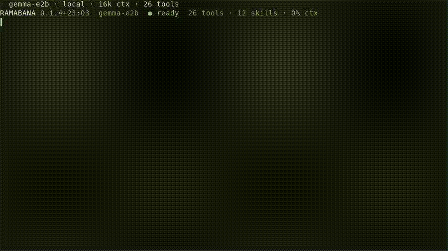

# ramabana


<!-- WARNING: THIS FILE WAS AUTOGENERATED! DO NOT EDIT! -->

<p align="center">


</p>

[`Agent`](https://vedicreader.github.io/ramabana/agent.html#agent) runs a model against the tools a host supplies. A host defines the folders, network access, memory, and approval gate the model gets. The terminal, MCP server, and Agent Client Protocol server share the same agent and tool contracts.

Start with one folder. Ramabana writes only inside the folders `--root` names, and reads stay inside them too. `--read-outside` lets reads reach the whole machine.

<p align="center">


</p>

## Install

Ramabana needs Python 3.12 or newer. The core is the agent, its hosts, and the file, code, shell and git tools. Each extra adds one use:

``` sh
pip install ramabana           # the core, to build an agent or an app on
pip install 'ramabana[cli]'    # the terminal session, with search and python
pip install 'ramabana[all]'    # every extra
```

| extra | adds |
|----|----|
| `[search]` | semantic code search, the vault’s memory and watches, the web tools |
| `[python]` | the Python prompt and `--attach`, on dhrishti |
| `[serve]` | `ramabana-mcp` and `ramabana-acp` |
| `[dhrona]` | warm starts from dhrona’s example rounds |
| `[cli]` | the terminal session, plus `[search]` and `[python]` |

A framework picks what it needs, such as `ramabana[search,serve]`. Without an extra, its tool groups drop out of the catalog, and its commands name the extra to install.

The core install includes what shalya needs: dhrishti, jupyter-client, fossick, litesearch and vishalakshi, which brings in mcp. The extras add the CLI, serve, python and search pieces.

For the terminal on its own, `uv tool install 'ramabana[cli]'`, then `ramabana`. The first interactive run starts inside a tmux server of ramabana’s own, so the now pane and shift+enter need no tmux setup. When tmux is missing, it offers the install command once. `ramabana --doctor` checks tmux, extended keys, the config and `ramabana-pane`. `--tmux off` or `RAMABANA_TMUX=off` keeps the session in the terminal you started it in. Detaching or closing the window ends the session, and `--resume latest` reopens it.

| command | what it is |
|----|----|
| `ramabana` | the terminal session, on teleprint. Needs `[cli]` |
| `ramabana-mcp` | the MCP server. Needs `[serve]` |
| `ramabana-acp` | the Agent Client Protocol server an editor launches. Needs `[serve]` |
| `ramabana --python` | the Python prompt, on dhrishti. Needs `[python]` |
| `ramabana-tick` | the scheduled beat, on pobblebonk |

## Point it at a model

`--model` names the model this session’s turns run on. Without it the turn model is `$RAMABANA_MODEL`, then `$LEELA_MODEL`, then `claude-opus-5-5` through Claude Code. No default runs on the device: a local model runs only when you name it.

``` sh
ramabana --root . --model sonnet
export RAMABANA_MODEL=sonnet    # the same choice in every session
```

| names | runs on | credential |
|----|----|----|
| `opus`, `sonnet`, `fable`, `haiku`, `claude-opus-5-5`, `claude-sonnet-5`, `claude-fable-5-1` | Claude Code | a `claude /login` session |
| `gpt`, `gpt-mini`, `gpt-sol`, `gpt-5.6`, `gpt-4.1`, `gpt-4.1-mini` | the OpenAI API | `OPENAI_API_KEY` |
| `gpt-5.5`, `gpt-5.3-codex-spark` | Codex | a Codex login |
| `anthropic/<id>` | the Anthropic API | `ANTHROPIC_API_KEY` |
| `copilot/<id>` | GitHub Copilot | a Copilot sign-in |
| `gemma-e2b`, `gemma-e4b`, `gemma-12b` | LiteRT, on the device | none |
| `qwen-4b`, `mini-coder-4b`, `ornith-9b` | MLX, on Apple silicon | none |
| `llama-qwen-0.6b`, `llama-qwen-1.7b`, `llama-qwen-4b` | llama.cpp, on the device | none |
| `ollama/<id>` | the ollama daemon | none |

`/models` lists what this machine can reach and marks the one running. `/model NAME` changes model without ending the session. `/model` alone prints the routing summary.

Short jobs route away from the turn model. Completions, inline edits, classification, summaries and other one-shot work run on `gpt-4.1`. Delegated sub-agents run on `claude-sonnet-5`. When the turn model is local, every job without a model of its own stays on it, so nothing leaves the machine. When a job’s model cannot run, because its key is unset or `claude` is missing, the job moves to another cloud route: without `OPENAI_API_KEY` the `gpt-4.1` jobs use `claude-sonnet-5`, and the session says so once. With none left, the error names the job, the model and the key or CLI it needs.

`$RAMABANA_MODEL_<JOB>` overrides one job. `<JOB>` is `ONESHOT`, `INLINE`, `COMPLETION`, `CLASSIFY`, `SUMMARY` or `SUBAGENT`. The turn model uses `$RAMABANA_MODEL` and has no `_TURN` variable. `/model JOB NAME` sets one job inside a session:

``` sh
export RAMABANA_MODEL_SUBAGENT=gpt-5.6-luna
```

## Your first session

``` sh
ramabana --root .
```

This opens the current folder, asks before every write, and runs on the default model. Type a task and press enter. `/help` prints the key card and `/guide` the longer tour. `ctrl+c` stops a running turn and `ctrl+d` quits.

Pass a prompt instead and Ramabana runs one turn, prints the answer on stdout, and exits:

``` sh
ramabana --root . 'Find where request timeouts are configured.'
ramabana --root . 'Summarise the open TODOs' > todos.md
```

The one-turn form prints each problem on stderr and exits 1 when the turn model was not up, so a script or a git hook can use it.

## The terminal, option by option

| option | default | what it does |
|----|----|----|
| `--root A,B` | `.` | the folders it may read and write, comma separated |
| `--model NAME` | routing default | the model this session’s turns run on |
| `--approve MODE` | `ask` | `ask`, `edits`, `auto`, `off` or `none`. `edits` lets file and notebook edits through and asks for the rest |
| `--no-web` | web on | takes the network away from the web tools |
| `--read-outside` | off | reads may name any path. Writes stay inside `--root` |
| `--subagent-writes` | off | delegated sub-agents may write, run commands and run Python |
| `--vault` | off | keeps what the agent reads in a vishalakshi vault |
| `--pii MODE` | `off` | `redact` or `refuse` for what the vault hands back |
| `--pii-ner` | off | `--pii` gates titled names too, not only patterns |
| `--spec` | off | adds `api_load`, `api_ops` and `api_call` |
| `--theme NAME` | `auto` | the terminal palette |
| `--max-tool-calls N` | `auto` | 20 to 400 tool calls per turn |
| `--max-steps N` | `auto` | 8 to 80 steps per turn, each a model call and its tools |
| `--cfg DIR` | `~/.config/ramabana` | skills, extensions, history and plans |
| `--resume ID` | none | reopen a saved session by id, by prefix, or `latest` |
| `--python` | off | start in Python mode, on a kernel of your own |
| `--attach NAME` | none | join a live Python session |
| `--agent-proxy` | off | expose this session’s agent inside its Python prompt |
| `--kernels` | off | list live Python sessions and exit |
| `--json` | off | with a prompt: reply, usage, changes, activity, problems and session as JSON |
| `--no-bell` | bell on | no terminal bell when a turn ends or an approval waits |
| `--tmux MODE` | `auto` | `on` or `off`: read the sibling panes and run background commands in panes. `off`, like `RAMABANA_TMUX=off`, also keeps the session out of ramabana’s own tmux |
| `--pane MODE` | `auto` | `on` or `off`: the now pane at startup. `auto` opens it only inside tmux |
| `--doctor` | off | check tmux and the now pane, offer to install tmux, and exit |
| `--optin A,B` | none | extra tool groups: `exhash` (the hash-addressed `edit_file`), `research`, `author`, `legacy` |
| `--warm` / `--no-warm` | on for `full`, off for `small` | seed the chat with a few of dhrona’s example rounds (`uv add "ramabana[dhrona]"`), or start empty. `small` starts cold since a small model copies an example’s paths literally. `--warm` gives it one round |
| `--profile P` | `auto` | `small` offers fourteen tools and a one-screen briefing. `full` offers everything. `auto` picks `small` for a local model or a window of 32k or less. `/model` shows the active one. `small` leaves out extension tools not marked with [`ramabana.tools.small_tool`](https://vedicreader.github.io/ramabana/tools.html#small_tool) |

`--theme` takes `auto`, `github-dark`, `dark`, `light`, `gruvbox`, `gruvbox-light`, `nord`, `tokyonight`, `catppuccin`, `latte`, `everforest`, `dracula`, `kanagawa`, `solarized` or `solarized-light`. `auto` is `github-dark`. Set your terminal to the scheme of the same name and the two agree. `/theme NAME` switches mid-session and repaints what is already on screen.

## Inside a session

Type `/` and press tab to complete a command. The list holds this session’s commands, extensions included.

| command | what it does |
|----|----|
| `/help`, `/guide` | the key card, then the longer tour |
| `/model [JOB] [NAME]`, `/models [all]` | the routing summary, a switch, or what this machine can reach |
| `/sessions`, `/resume [ID\|latest]` | the saved sessions, and reopening one |
| `/plan`, `/todo ID done\|active\|pending\|cancelled` | the checklist the agent works through |
| `/cost`, `/compact [NOTE]` | what the session has spent, and shortening the history |
| `/tool-budget [auto\|20..400]`, `/steps [auto\|8..80]` | the per-turn budgets, and what the last turn used |
| `/approve [off\|ask\|edits\|auto]`, `/subagents [on\|off\|steps N\|timeout S\|nest N]` | who may write, whether delegates may, and their limits |
| `/commit [FOLDER] [MESSAGE]`, `/pr [FOLDER] [TITLE]` | a commit or pull request drafted from the diff of the repository holding FOLDER (default the project), behind approval |
| `/rewind [TURN] [files\|chat\|both]`, `/branches`, `/branch NAME` | undo a turn’s files or chat, and the conversation branches. Undo restores edits, undoes git writes, and removes created files still unchanged |
| `/watch [RUN\|monitors]`, `/unwatch`, `/tell RUN TEXT` | a tmux pane on a run’s transcript, and a message to a running sub-agent |
| `/pane`, `/pane off` | the now pane in a tmux split, and closing it |
| `/NAME ARGS`, `#note TEXT` | run a skill, or `<cfg>/commands/NAME.md` as a turn with `$ARGUMENTS`, `$1..$n` and `@path` filled in. A repo’s `.agents/commands/` counts once `project_extensions` is opted in. `#note` saves a line to the next session’s memory |
| `/root [add PATH]`, `/theme [NAME]`, `/mouse` | the open folders, the palette, and clicking blocks |
| `/attach PATH`, `/detach [N]`, `/paste`, `/copy [turn]` | files and images in, text out |
| `/skills`, `/skill NAME`, `/tools`, `/extensions`, `/reload` | what this session loaded, and loading it again |
| `/python`, `/agent`, `/vars`, `/promote NAME` | the Python prompt and its namespace |
| `/kernels`, `/join NAME`, `/agent_proxy` | live Python sessions |
| `/stop [ID]`, `/runs [all]` | the runs in flight |
| `/quit`, `/exit` | leave |

The keys:

| key | what it does |
|----|----|
| `enter` | send. Mid-turn it steers: the running turn gets the line after its current tool call. A line with an `@path`, or sent with an attachment, waits for the next turn. `tab` completes a `/command` or an `@path` |
| `shift+enter` | mid-turn, queue the line as the next turn. It needs tmux extended keys, which ramabana’s own tmux has. Inside your tmux, ramabana turns them on for that server when they are off |
| `shift+tab` | cycle approvals through `ask`, `edits` and `auto`. The mode shows at the left of the row under the bar |
| `ctrl+t` | show or hide the plan |
| `ctrl+p`, `ctrl+n` | walk the prompts you have sent |
| `up`, `down`, `ctrl+r` | browse the transcript. `pgup`, `pgdn`, `/?` to search, `y` to copy a block, `esc` to leave |
| `ctrl+o` | fold or open all the working of a turn |
| `alt+1` to `alt+9` | open one entry of it |
| `ctrl+g` | make approvals one step stricter |
| `ctrl+v` | attach an image from the clipboard |
| `ctrl+c` | stop the turn and drop queued lines and any steering the turn has not taken yet. A second press terminates it, a third quits |
| `ctrl+d` | quit |

A turn reads top to bottom: `┆` narration, `│` a tool call, then the answer. To send a file or an image with the prompt, drop its path on the terminal, write `@path` in the prompt, or use `/attach PATH`.

## Approvals

An approval gate guards the write tools. `--approve` sets its mode.

| mode    | what happens                                      |
|---------|---------------------------------------------------|
| `ask`   | every write waits for you. The default            |
| `edits` | file and notebook edits run; other writes wait    |
| `auto`  | writes run unattended for the rest of the process |
| `off`   | the gate refuses every write                      |
| `none`  | no gate at all                                    |

At an approval prompt:

- `y` approves.
- `n` refuses.
- `a` approves everything for the rest of the session.
- `ctrl+y` approves with a note.
- A typed reason and enter refuses with that reason.

`shift+tab` cycles `ask`, `edits`, `auto` and back to `ask`. From `off` it comes back in at `ask`. `ctrl+g` moves one step stricter, from `auto` to `ask` to `off`, and never the other way. `/approve MODE` moves in either direction and answers any prompt already waiting.

The gate covers every tool with an effect:

- files: `replace_text`, `create_file`, `edit_cell`, `add_cell`, and `edit_file` when `--optin exhash` offers it
- code: `run_python`, `run_shell`, `run_shell_bg`
- git: `git_commit`, `git_checkout`, `git_stash`, `git_remote`
- the rest: `memory_forget`, `create_skill`, `cancel_watch`, `add_root`, `cart_add`, `cart_remove`

Git goes through those tools. `run_shell` refuses `git commit|push|pull|fetch|stash|switch|checkout` and names the tool to use. Ramabana snapshots every git write so `/rewind` can undo it. When the same gated call comes three times running, Ramabana asks you rather than run or refuse it again, whatever the mode.

## The folders it can touch

`--root` is the file policy. Name every folder, comma separated:

``` sh
ramabana --root .,~/notes,/srv/app
```

Writes reach those folders and nowhere else. Reads start out in the same folders. `--read-outside` widens reads to any path on the machine and leaves writes where they were. `/root` prints the open folders, and `/root add PATH` opens another mid-session for reading and writing.

Delegated sub-agents only look: they report what they found and change nothing. `--subagent-writes`, or `/subagents on`, lets them write, run commands and run Python behind this session’s approvals. Until then Ramabana refuses `delegate_async(writes=True)`, and the briefing says so.

A sub-agent takes at most 12 steps and runs for at most 900 seconds; `/subagents steps N` and `/subagents timeout S` change either, and `timeout 0` removes the limit. A delegation’s `max_steps` can ask for fewer steps, never more. Sub-agents do not delegate again unless `/subagents nest 1` or `nest 2` allows it. A nested sub-agent gets only `delegate_search`, the sub-agents under one turn share one tool-call budget the size of the turn’s own, and at most four of them run at once.

Every run keeps a transcript under `<cfg>/runs/<session>/`. Inside tmux:

- `/watch RUN` opens a pane that tails the transcript.
- `/watch monitors` tails the folder reviews.
- `/tell RUN TEXT` sends a running sub-agent a message. It gets the message with its next tool result.
- `read_terminal` reads the sibling panes.
- `run_shell_bg` runs in a pane of its own.

`/pane` opens the now pane in a split on the right. It shows the turn, the call it is on, and each sub-agent run with its own calls. The split needs tmux 3.1 or later, and `--pane on` opens it at startup. Without tmux, or with `--tmux off`, `/pane` prints the `ramabana-pane` command to run in another terminal instead.

## Budgets, cost and history

A turn runs until the model stops calling tools. `--max-tool-calls` caps the tool calls. `--max-steps` caps the steps, each one model call and the tools it runs. Both take `auto` or a number: 20 to 400 calls, 8 to 80 steps. `/tool-budget` and `/steps` change them mid-session and print what the last turn ran under.

`/cost` prints:

- the tokens in and out
- the cached share
- the reasoning tokens
- the spend, when the backend reports one

`/compact` summarises the history so far and carries on with the shorter context. `/compact NOTE` tells the compactor what to keep.

Ramabana saves every session with a completed turn under `--cfg`, which defaults to `~/.config/ramabana`. `/sessions` lists them with their turn counts and models. `/resume ID` reopens one from a full id or a unique prefix. From the shell:

``` sh
ramabana --root . --resume latest
```

A resumed session brings back its history and its plan. It prints on stderr any other folder that session had open, and `/root add PATH` opens it again.

## Python mode

`--python` starts a Jupyter kernel that belongs to you, with the agent in the layer above it:

``` sh
ramabana --root . --python
```

Enter runs code that compiles, tab completes identifiers, and `ctrl+c` interrupts the cell. `/agent` hands the line back to the model and `/python` takes it again. The agent reads your namespace and writes only to its own overlay. `/vars` shows what is in the namespace, and `/promote NAME` moves one of the agent’s values into it.

Other terminals can share a live session. `ramabana --kernels` lists the ones running, `--attach NAME` joins one from another terminal, and `/join NAME` joins one from inside a session. `--agent-proxy` binds this session’s agent where the Python prompt can reach it, behind a proxy that restricts usage and callbacks.

## Memory, API specifications and a beat

`--vault` keeps what the agent reads in a [vishalakshi](https://github.com/vedicreader/vishalakshi) vault, for the next session to retrieve. `--pii redact` masks personal data on the way back out of the vault. `--pii refuse` refuses the retrieval instead. `--pii-ner` extends either mode to titled names, not only patterns. Either mode needs `--vault`. Without it the command exits 2 rather than ignore the flag. A `--python`, `--attach` or `--agent-proxy` session has no vault-backed host, so it refuses `--vault`.

`--spec` adds `api_load`, `api_ops` and `api_call`. Point `api_load` at an OpenAPI, Azure or Google Discovery document and the agent can call the operations it describes.

`ramabana-tick` runs the due schedules and leaves their findings as notes for the next session. It schedules itself through cron, launchd or `schtasks`. A beat fires when no session is open:

``` sh
ramabana-tick --install --every 300    # a beat every five minutes
ramabana-tick                          # one beat now
ramabana-tick --uninstall
```

## Skills and extensions

A skill is markdown the agent reads when the work calls for it. Ramabana looks for skills in these folders, in order:

- `<cfg>/skills`
- `~/.agents/skills`
- `.leela/skills` and `.agents/skills` under each open folder

When two skills share a name, the later folder wins. Each skill is a folder holding a `SKILL.md`. Four skills ship in the package: `coding_patterns`, `theory`, `write_prose` and `write_docs`. `/skills` lists what this session found, and `/skill NAME` prints one.

An extension is a Python file in `<cfg>/extensions` with a `setup(reg)` function. It can:

- add a tool
- add a slash command
- register a skill
- hook the turn
- replace the approval policy

``` python
def setup(reg):
    @reg.tool
    def deploy_status() -> str:
        "What is deployed right now."
        return open('/var/run/deploy').read()

    reg.command('deploys', lambda agent, arg: deploy_status(), help='what is deployed')
    reg.on('after_tool', lambda agent, name, out: print(name, file=open('/tmp/tools.log', 'a')))
```

The hook events are `before_turn(agent, prompt)`, `after_turn(agent, text)`, `before_tool(agent, name, args)`, `after_tool(agent, name, out)`, `compact(agent, text)` and `approval`. `reg.approval(fn)` replaces the approval policy, and the last registration wins. `/extensions` prints one line per extension: loaded, or why not. `/reload` loads skills, extensions and tools again after an edit.

## Serve the tools to another assistant

`ramabana-mcp` serves one host’s tools over MCP:

``` sh
ramabana-mcp --root .
```

By default the server mounts only the read tools, because the client cannot reach this process’s approval gate. `--write` mounts the write tools too. `--model NAME` adds one further tool, `ask`, which runs a whole Ramabana turn and returns only its answer. `--model` also builds the agent. The mounted tools are then the same objects a turn gets, and they record into the same activity log. The server offers skills as resources rather than tools: an index, plus one per skill. A client lists them and fetches the one it needs.

| option | default | what it does |
|----|----|----|
| `--root A,B` | `.` | the folders to serve |
| `--model NAME` | none | adds the `ask` tool, running on this model |
| `--write` | off | mount the write tools too |
| `--no-web` | web on | takes the network away from the web tools |
| `--read-outside` | off | reads may name any path. Writes stay inside |
| `--vault`, `--pii MODE`, `--pii-ner` | off | as in the terminal |
| `--transport NAME` | `stdio` | `stdio`, `sse` or `streamable-http` |
| `--cfg DIR` | none | skills and extensions, with `--model` |

A model-less server still finds skills in the served folders and in `~/.agents/skills`. The server loads `--cfg` and its extensions only when `--model` builds the agent.

A client that launches its own servers takes the command:

``` json
{"mcpServers": {"ramabana": {"command": "ramabana-mcp", "args": ["--root", "/srv/app"]}}}
```

## Run it inside an editor

`ramabana-acp` speaks the [Agent Client Protocol](https://agentclientprotocol.com/). An editor launches it and drives it against the editor’s own files and terminal.

Zed takes agents from `agent_servers` in `settings.json`:

``` json
{"agent_servers": {"Ramabana": {"command": "ramabana-acp", "args": ["--root", "."]}}}
```

The editor names the folder. `--root` here is the fallback for a client that names none. Approvals arrive as the editor’s own permission prompt. `--model`, `--no-web`, `--vault`, `--pii`, `--pii-ner` and `--cfg` work as they do in the terminal.

## Drive it from Python

[`ramabana.agent.mk_agent`](https://vedicreader.github.io/ramabana/agent.html#mk_agent) builds what the terminal runs: a host over the named folders, and an [`Agent`](https://vedicreader.github.io/ramabana/agent.html#agent) gated the way `approve` says. The example below uses the same [`Agent.ask`](https://vedicreader.github.io/ramabana/agent.html#agent.ask) path with [`fake_agent`](https://vedicreader.github.io/ramabana/testing.html#fake_agent), which supplies a deterministic backend and an in-memory project. It runs without credentials, downloads, or writes to disk.

``` python
from ramabana.testing import fake_agent

agent, backend = fake_agent(replies=['The threshold is defined in `pkg/sizes.py`.'])
answer = agent.ask('Where is the threshold defined?')
answer
```

    'The threshold is defined in `pkg/sizes.py`.'

``` python
assert answer == 'The threshold is defined in `pkg/sizes.py`.'
assert agent.history[-1]['prompt'] == 'Where is the threshold defined?'

agent.turn_lines(), repr(agent.turn_use)
```

    (['🔍 Search Where is the threshold defined?'],
     '15 tok · in 10 · out 5 · model')

## Read the implementation

Start with the page for the contract you need:

- [core](00_core.ipynb): errors, routing, model budgets, and shared values
- [models](01b_models.ipynb): the model catalog, curated and discovered
- [runtime](01_runtime.ipynb): backends, usage, runs, and compaction
- [tools](02_tools.ipynb): hosts, tool construction, and delegation
- [agent](03_agent.ipynb): turns, approvals, activity, plans, history, and branching
- [testing](04_testing.ipynb): in-memory hosts and deterministic backends
- [terminal](05_cli.ipynb), [MCP](06_mcp.ipynb), [PyREPL](11_pyrepl.ipynb), and [ACP](16_acp.ipynb): frontend adapters, the [now pane](18_pane.ipynb) beside the terminal, and the [first-run setup](19_setup.ipynb) that starts it in tmux
- [vault](07_vault.ipynb), [API specifications](10_spec.ipynb), and [folder monitoring](17_monitor.ipynb): optional capabilities
- [shop](08_shop.ipynb): product search tools
- [coding patterns](09_coding_patterns.ipynb), [theory](13_theory.ipynb), [prose](14_write_prose.ipynb), and [documentation](15_write_docs.ipynb): bundled agent skills

The toolset itself is [shalya](https://github.com/vedicreader/shalya), the git plumbing is [gheasy](https://github.com/vedicreader/gheasy), and the scheduler is [pobblebonk](https://github.com/vedicreader/pobblebonk).

## Develop Ramabana

The notebooks are the source. nbdev generates every module under `ramabana/`, and this page too.

``` sh
uv sync --all-extras --group dev
uv run nbdev-prepare    # export, test the notebooks, clean them, rebuild the README
uv run pytest           # the plain-python suite
```

Edit `nbs/*.ipynb`, never the exported `.py`.
